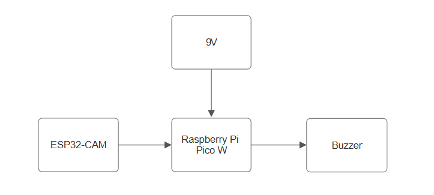
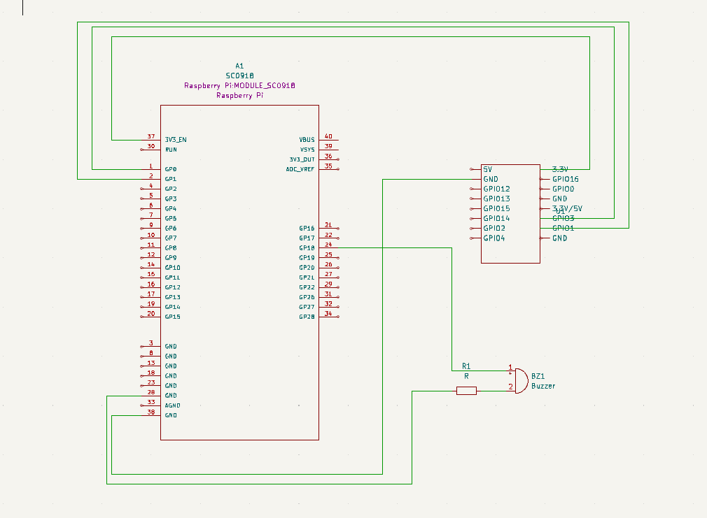

# Street Signs Recognition

|`Author` |  `Andreea-Cristiana Vlad` |

## Description
The aim of this project is to recognize basic street signs and play a recorded message related to the meaning of the sign encountered. It is supposed to incorporate a simple camera for the sign recognition, and correlate the images to their respective audio description, which will be played using a simple buzzer.

## Motivation
A big motivation in creating this project has been my wish to discover the applications of this subject in real life situations. For this reason, my initial idea was to create a device capable of scanning documents and "reading" the contents aloud (for example as an aid for people facing sight difficulties). As the idea relies mostly on programming outside the capabilities of a microcontroller, I decided to make the necessary changes in order to use the microcontroller more while keeping true to the initial purpose of the project.

## Architecture

### Block diagram

<!-- Make sure the path to the picture is correct -->

### Schematic

### Components

<!-- This is just an example, fill in with your actual components -->

| Device | Usage | Price |
|--------|--------|-------|
|ESP32-CAM WiFi|Camera|[89.99 RON](https://www.emag.ro/placa-de-dezvoltare-esp32-cam-wifi-micro-usb-la-serial-port-cu-ov2640-2mp-modul-camera-compatibil-cu-arduino-x001d0qn4v/pd/DCFMYDYBM/?cmpid=101207&utm_source=google&utm_medium=cpc&utm_campaign=(RO:Whoop!)_3P-Y_%3E_Retelistica_and_Supraveghere&utm_content=79559753754&gad_source=1)|
|Raspberry Pi Pico W|Microcontroller|[34.50 RON](https://www.optimusdigital.ro/ro/placi-raspberry-pi/12394-raspberry-pi-pico-w.html?search_query=Raspberry+Pi+Pico+W&results=24)
|0.25 W 22K Ω Resistor|Resistor|[0.10 RON]|
| Activ Buzzer | Buzzer | [1.5 RON](https://www.optimusdigital.ro/ro/audio-buzzere/635-buzzer-activ-de-3-v.html?search_query=buzzer&results=61) |
| Jumper Wires | Connecting components | [7 RON](https://www.optimusdigital.ro/ro/fire-fire-mufate/884-set-fire-tata-tata-40p-10-cm.html?search_query=set+fire&results=110) |
| Breadboard | Project board | [10 RON](https://www.optimusdigital.ro/ro/prototipare-breadboard-uri/8-breadboard-830-points.html?search_query=breadboard&results=145) |

### Libraries

<!-- This is just an example, fill in the table with your actual components -->

| Library | Description | Usage |
|---------|-------------|-------|
| [lib-name1](link-to-lib) | official description of the lib | Used for accesing the peripherals of the microcontroller  |
| [lib-name2](link-to-lib) | official description of the lib | Used for accesing the peripherals of the microcontroller  |

## Log

<!-- write every week your progress here -->

### Week 6 - 12 May

### Week 7 - 19 May

### Week 20 - 26 May

## Reference links

<!-- Fill in with appropriate links and link titles -->

[Tutorial 1](https://www.youtube.com/watch?v=wdgULBpRoXk&t=1s&ab_channel=BenEater)

[Article 1](https://www.explainthatstuff.com/induction-motors.html)

[Link title](https://projecthub.arduino.cc/)
